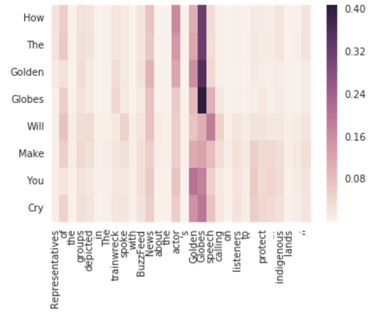

# How_to_make_a_text_summarizer
This is the code for "How to Make a Text Summarizer - Intro to Deep Learning #10" by Siraj Raval on Youtube.

# Coding Challenge - Due Date - Thursday, March 23rd at 12 PM PST

The challenge for this video is to make a text summarizer for a set of articles with Keras. You can use any textual dataset to do this. By doing this you'll learn more about encoder-decoder architecture and the role of attention in deep learning. Good luck!

## Overview

This is the code for [this](https://youtu.be/ogrJaOIuBx4) video on Youtube by Siraj Raval as part of the Deep Learning Nanodegree with Udacity. We're using an [encoder-decoder](https://www.tensorflow.org/tutorials/seq2seq) architecture to generate a headline from a news article.

## Dependencies

* [Tensorflow](https://www.tensorflow.org/versions/r0.10/get_started/os_setup.html) or [Theano](http://deeplearning.net/software/theano/install.html)
* Keras 
* python-Levenshtein (pip install python-levenshtein)

Use [pip](https://pypi.python.org/pypi/pip) to install any missing dependencies.

## Basic Usage

### Data
The video example is made from the text at the start of the article, which I call description (or `desc`),
and the text of the original headline (or `head`). The texts should be already tokenized and the tokens separated by spaces.
[This](http://research.signalmedia.co/newsir16/signal-dataset.html) is a good example dataset. You can use the 'content' as the 'desc' and the 'title' as the 'head'. 

Once you have the data ready save it in a python pickle file as a tuple:
`(heads, descs, keywords)` were `heads` is a list of all the head strings,
`descs` is a list of all the article strings in the same order and length as `heads`.
I ignore the `keywrods` information so you can place `None`.

[Here](http://opendata.stackexchange.com/questions/4981/dataset-of-major-newspapers-content) is a link on how to get similar datasets

### Build a vocabulary of words
The [vocabulary-embedding](./vocabulary-embedding.ipynb)
notebook describes how a dictionary is built for the tokens and how
an initial embedding matrix is built from [GloVe](http://nlp.stanford.edu/projects/glove/).

### Train a model
The [train](./train.ipynb) notebook describes how a model is trained on the data using [Keras](http://keras.io/).

### Use model to generate new headlines
The [predict](./predict.ipynb) notebook generate headlines by the trained model and
showes the attention weights used to pick words from the description.
The text generation includes a feature which was
not described in the original paper, it allows for words that are outside
the training vocabulary to be copied from the description to the generated headline.

## Examples of headlines generated
Good (cherry-picked) examples of headlines generated:

## Examples of attention weights

## Credits
The credit for this code goes to [udibr](https://github.com/udibr) i've merely created a wrapper to make it easier to get started. 
